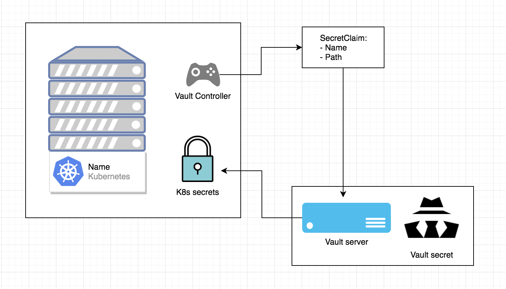

# secretClaim.yaml



The `secretClaim` will be used by the `Vault Controller`. Based on the Path and Name, Vault controller will look inside the `Vault server`, get the secret and store in Kubernetes secrets.

Example code for the secretClaim

```text
{{- if .Values.vault.enable }}
kind: SecretClaim
apiVersion: vaultproject.io/v1
metadata:
  name: {{ template "fullname" . }}
  labels:
    {{- include "labels.standard" . | indent 4 }}
spec:
  type: Opaque
  path: "{{ .Values.vault.path }}"
  renew: 3900
{{- end }}
```

